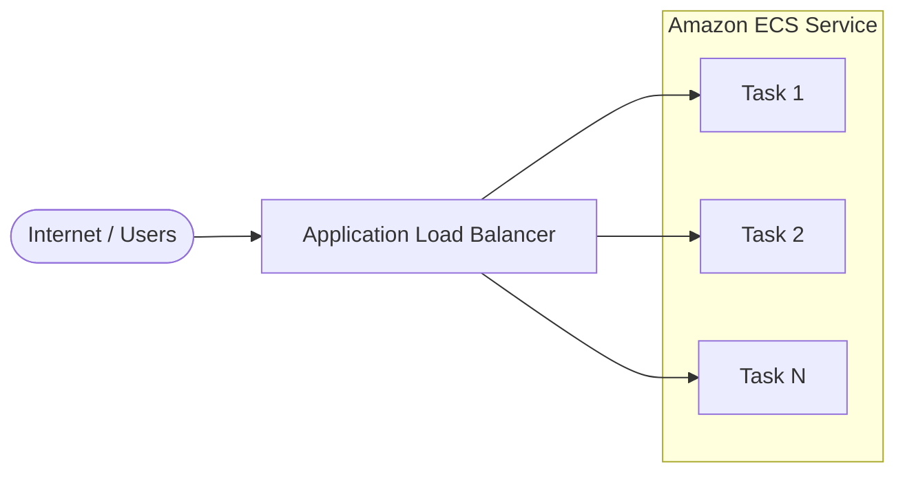

# AWS Architecture

A simple AWS architecture using an Application Load Balancer in front of an
ECS service.

## Overview

Incoming traffic from the internet is routed through an Application Load
Balancer (ALB), which distributes requests across tasks running in an Amazon
ECS service. The ECS service runs containerized application tasks and scales
to meet demand.

## Diagram

## Components

| Component | Description |
| --- | --- |
| **Application Load Balancer** | Public entry point. Terminates connections, performs health checks, and distributes traffic across ECS tasks. |
| **Amazon ECS Service** | Runs and maintains the desired number of containerized tasks. Registers tasks as targets behind the ALB and scales based on load. |

## Request Flow

1. A user sends a request over the internet.
2. The Application Load Balancer receives the request and selects a healthy
   ECS task from its target group.
3. The chosen ECS task processes the request and returns a response back
   through the ALB to the user.
